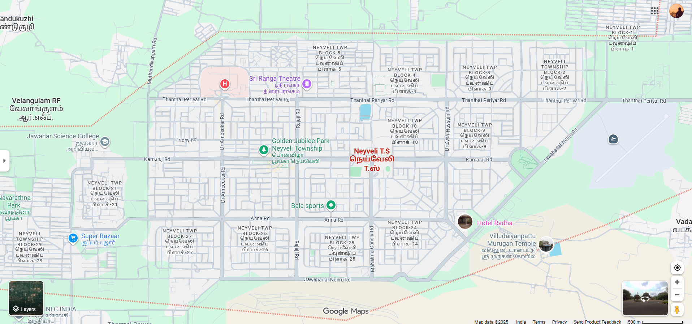
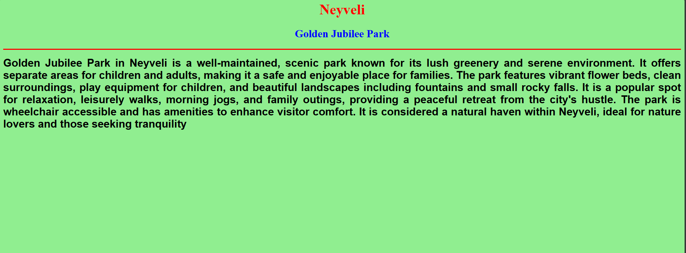
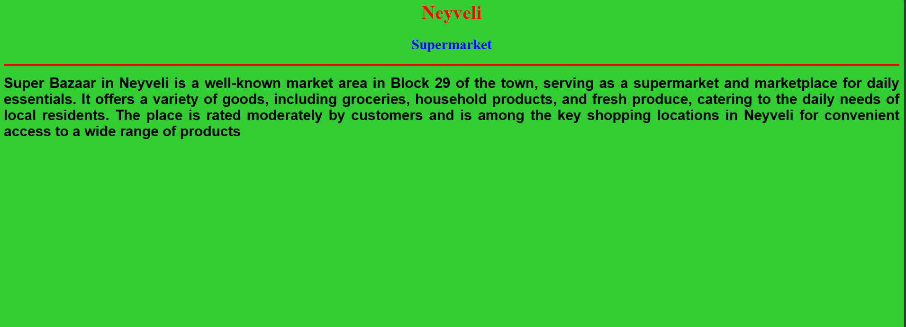
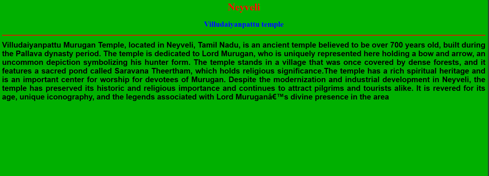
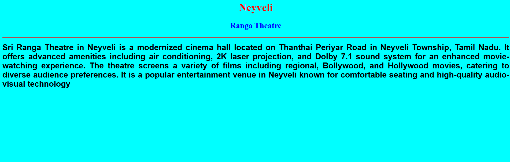
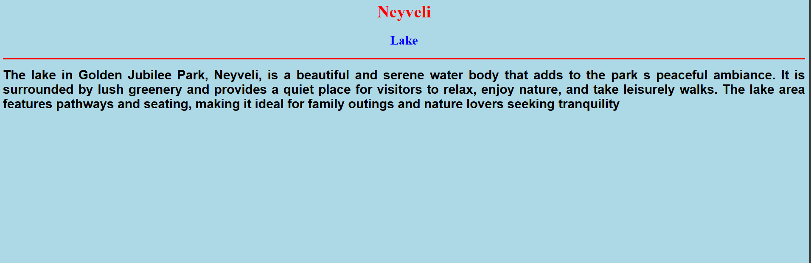

# Ex04 Places Around Me
## Date: 02/10/2025

## AIM
To develop a website to display details about the places around my house.

## DESIGN STEPS

### STEP 1
Create a Django admin interface.

### STEP 2
Download your city map from Google.

### STEP 3
Using ```<map>``` tag name the map.

### STEP 4
Create clickable regions in the image using ```<area>``` tag.

### STEP 5
Write HTML programs for all the regions identified.

### STEP 6
Execute the programs and publish them.

## CODE
```
map.html

<!DOCTYPE html>
<html lang="en">
<head>
    <meta charset="UTF-8">
    <title>My City</title>
    <style>
        body { font-family: Arial, sans-serif; margin: 20px; }
        h1 { color: #2a6fa1; }
    </style>
</head>
<body>
    <h1 align="center">
        <font color="red"><b>Neyveli</font>
            </h1>
    <h2 align="center">
    <font color="blue"><b>Sanjay S (25017293)</b></font>
    </h2>
    <center>
    
    <map name="MyCity">
       
        <area shape="rect" coords="500,300,700,200" href="park.html" alt="Central Park" title="Central Park">
        <area shape="circle" coords="750,150,100,100" href="lake.html" alt="Lake" title="Lake">
        <area shape="rect" coords="600,100,700,200" href="theatre.html" alt="Theatre" title="Theatre">
        <area shape="rect" coords="100,600,200,300" href="supermarket.html" alt="Supermarket" title="Supermarket">
        <area shape="rect" coords="1600,400,1000,700" href="temple.html" alt="Temple" title="Temple">
    </map>
    </center>
</body>
</html>

park.html

<html>
    <head>
        <title>My Home Town</title>
    </head>
    <body bgcolor="lightgreen">
        <h1 align="center">
            <font color="red"><b>Neyveli</font>
                </h1>
        <h2 align="center">
        <font color="blue"><b>Golden Jubilee Park</b></font>
        </h2>
        <hr size="3" color="red">
        <p align="justify">
            <font face="Arial" size="5">
               Golden Jubilee Park in Neyveli is a well-maintained, scenic park known for its lush greenery and serene environment. It offers separate areas for children and adults, making it a safe and enjoyable place for families. The park features vibrant flower beds, clean surroundings, play equipment for children, and beautiful landscapes including fountains and small rocky falls. It is a popular spot for relaxation, leisurely walks, morning jogs, and family outings, providing a peaceful retreat from the city's hustle. The park is wheelchair accessible and has amenities to enhance visitor comfort. It is considered a natural haven within Neyveli, ideal for nature lovers and those seeking tranquility
            </font>
            </p>
            </body>
            </html>

supermarket.html

<html>
    <head>
        <title>My Home Town</title>
    </head>
    <body bgcolor="limegreen">
        <h1 align="center">
            <font color="red"><b>Neyveli</font>
                </h1>
        <h2 align="center">
        <font color="blue"><b>Supermarket</b></font>
        </h2>
        <hr size="3" color="red">
        <p align="justify">
            <font face="Arial" size="5">
             Super Bazaar in Neyveli is a well-known market area in Block 29 of the town, serving as a supermarket and marketplace for daily essentials. It offers a variety of goods, including groceries, household products, and fresh produce, catering to the daily needs of local residents. The place is rated moderately by customers and is among the key shopping locations in Neyveli for convenient access to a wide range of products
            </font>
            </p>
            </body>
            </html>

 temple.html

 <html>
    <head>
        <title>My Home Town</title>
    </head>
    <body bgcolor="ruby">
        <h1 align="center">
            <font color="red"><b>Neyveli</font>
                </h1>
        <h2 align="center">
        <font color="blue"><b>Villudaiyanpattu temple</b></font>
        </h2>
        <hr size="3" color="red">
        <p align="justify">
            <font face="Arial" size="5">
                Villudaiyanpattu Murugan Temple, located in Neyveli, Tamil Nadu, is an ancient temple believed to be over 700 years old, built during the Pallava dynasty period. The temple is dedicated to Lord Murugan, who is uniquely represented here holding a bow and arrow, an uncommon depiction symbolizing his hunter form. The temple stands in a village that was once covered by dense forests, and it features a sacred pond called Saravana Theertham, which holds religious significance.The temple has a rich spiritual heritage and is an important center for worship for devotees of Murugan. Despite the modernization and industrial development in Neyveli, the temple has preserved its historic and religious importance and continues to attract pilgrims and tourists alike. It is revered for its age, unique iconography, and the legends associated with Lord Murugan’s divine presence in the area
            </font>
            </p>
            </body>
            </html>

theatre.html

<html>
    <head>
        <title>My Home Town</title>
    </head>
    <body bgcolor="cyan">
        <h1 align="center">
            <font color="red"><b>Neyveli</font>
                </h1>
        <h2 align="center">
        <font color="blue"><b>Ranga Theatre</b></font>
        </h2>
        <hr size="3" color="red">
        <p align="justify">
            <font face="Arial" size="5">
                Sri Ranga Theatre in Neyveli is a modernized cinema hall located on Thanthai Periyar Road in Neyveli Township, Tamil Nadu. It offers advanced amenities including air conditioning, 2K laser projection, and Dolby 7.1 sound system for an enhanced movie-watching experience. The theatre screens a variety of films including regional, Bollywood, and Hollywood movies, catering to diverse audience preferences. It is a popular entertainment venue in Neyveli known for comfortable seating and high-quality audio-visual technology
            </font>
            </p>
            </body>
            </html>

lake.html

<html>
    <head>
        <title>My Home Town</title>
    </head>
    <body bgcolor="lightblue">
        <h1 align="center">
            <font color="red"><b>Neyveli</font>
                </h1>
        <h2 align="center">
        <font color="blue"><b>Lake</b></font>
        </h2>
        <hr size="3" color="red">
        <p align="justify">
            <font face="Arial" size="5">
              The lake in Golden Jubilee Park, Neyveli, is a beautiful and serene water body that adds to the park s peaceful ambiance. It is surrounded by lush greenery and provides a quiet place for visitors to relax, enjoy nature, and take leisurely walks. The lake area features pathways and seating, making it ideal for family outings and nature lovers seeking tranquility
            </p>
            </body>
            </html>

```            

## OUTPUT













## RESULT
The program for implementing image maps using HTML is executed successfully.
